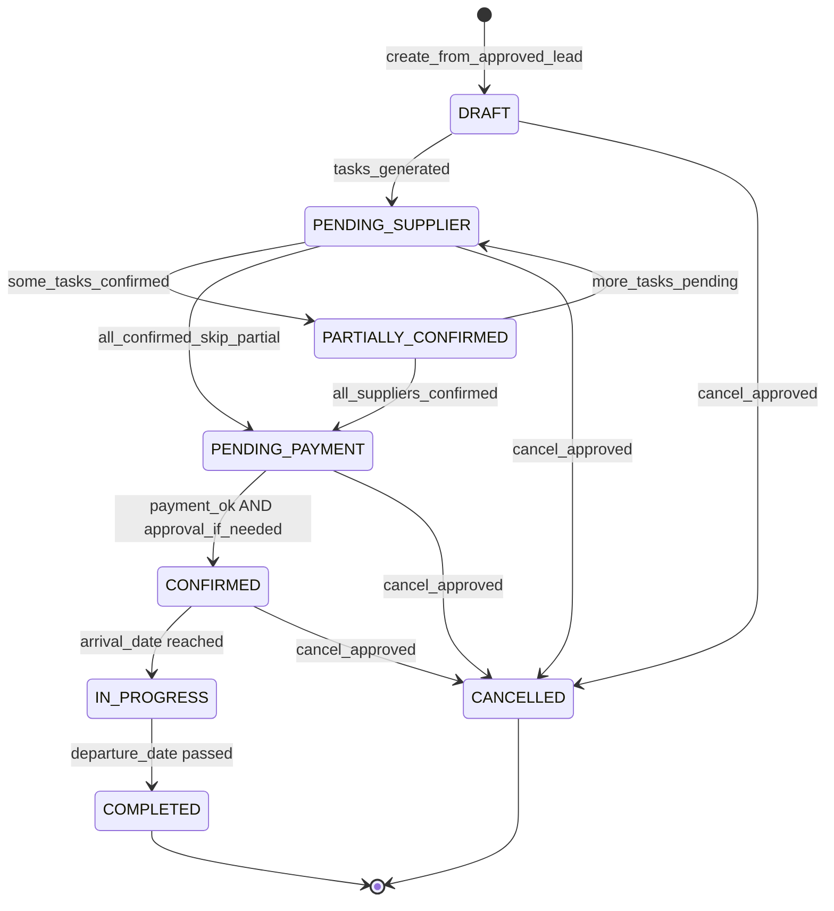

# Phase 2 — Arcadia Booking Agent Design
**التاريخ:** 28 أغسطس 2026  
**الحالة:** 📋 **Design only** — لا SQL · لا n8n · لا Orchestrator  
**ملف قابل للنسخ:** `deliverables/arcadia-phase2-booking-agent-design-ar.md`

---

## 0. السياق والقرارات المسبقة

| البند | القرار |
|-------|--------|
| Phase 1 | ✅ مغلق — Final Candidate Laila live على `laila-v4` |
| Pricing | ✅ يعمل — `quotes` (117) + RPC |
| `bookings` | ✅ **150** سجل تشغيل — **لا إعادة بناء** |
| Orchestrator | ❌ **خارج النطاق** في Phase 2 |
| Laila prompt | ❌ **لا تغيير** في Phase 2 |
| quotes / quote_offers | ❌ **لا توحيد** — نستخدم `quote_ref` كمرجع فقط |
| Booking Agent | ✅ تصميم + موافقة → ثم implementation |

### Phase 1 — Minor bug (مسجّل، لا يمنع Phase 2)

| Bug | التأثير | الإصلاح المقترح |
|-----|---------|-----------------|
| `lead_interactions.message_text` outbound = `[object Object]` | logging غير قابل للقراءة | في `Phase1 Prepare Outbound`: استخراج `de.response` أو `send.message?.conversation` بدل تمرير object خام |
| الأولوية | 🟡 minor | **Phase 2.0** (patch صغير قبل توسّع logging) |

---

## 1. Current Bookings Schema Audit

### 1.1 Overview

| Metric | Value |
|--------|-------|
| Total rows | **150** |
| PK | `booking_id` (text) — format: `KA-2026-116`, `RU-2026-029` |
| FK constraints | `destination` → `destinations(id)`, `lead_id` → `leads`, `customer_id` → `customers` |
| Phase 1 FKs populated | **0/150** (`lead_id`, `customer_id`, `quote_ref` كلها NULL — legacy manual ops) |

### 1.2 Columns — Usage Audit (150 rows)

| Column | Populated | Usage in ops |
|--------|-----------|--------------|
| `booking_id` | 150/150 | ✅ PK — manual numbering by destination/year |
| `client_name` | 150/150 | ✅ Guest / group lead name |
| `client_country` | ~most | ✅ Nationality |
| `client_phone` | **2/150** | ⚠️ rarely used — phone lives on lead/customer instead |
| `guest_count` | default 1 | ✅ Pax |
| `company_name` | sparse | B2B / agency name when applicable |
| `destination` | 150/150 | ✅ `kazakhstan`, `russia`, … (FK to destinations) |
| `cities` | 148/150 | ✅ JSON array of city names |
| `trip_type` | 150/150 | ✅ always `tourism` today |
| `city_hotels` | 137/150 | ✅ `{ "موسكو": "SADU", "سانت بطرسبرغ": "VALO" }` |
| `arrival_date` | 150/150 | ✅ |
| `arrival_time` | used | Flight arrival time text |
| `departure_date` | 150/150 | ✅ |
| `days_count` | used | Trip length |
| `services` | 149/150 | ✅ `["hotel","airport","tours","train"]` — **task source of truth** |
| `custom_services` | sparse | Free-text extras |
| `number_of_tours` | used | Tour count |
| `airport_pickup` | default true | Transfer flag |
| `total_amount` | 149/150 | ✅ Selling price USD |
| `paid_amount` | 35/150 | ✅ Partial payments tracked manually |
| `payment_method` | 149=`company`, 1=`destination` | ✅ Who collects payment |
| `is_paid` | 8/150 | ⚠️ inconsistent with `paid_amount` (some paid_amount>0 but is_paid=false) |
| `status` | see below | ✅ Operational lifecycle (legacy enum) |
| `service_costs` | **0/150** | ❌ unused |
| `notes` | **0/150** | ❌ unused (opportunity: operational notes) |
| `created_by` / `modified_by` | 150/150 `admin` | ✅ Staff attribution |
| `created_at` / `last_modified` | 150/150 | ✅ |
| `lead_id` | 0/150 | 🆕 Phase 1 column — **ready, not backfilled** |
| `customer_id` | 0/150 | 🆕 Phase 1 column — **ready** |
| `quote_ref` | 0/150 | 🆕 Phase 1 column — **ready** |

### 1.3 Legacy `bookings.status` Distribution

| status | count | % |
|--------|-------|---|
| `confirmed` | 136 | 91% |
| `pending` | 10 | 7% |
| `cancelled` | 2 | 1% |
| `in_hotel` | 2 | 1% |

**ملاحظة:** Legacy statuses are **post-sale ops states**, not pre-booking draft flow. Most rows skip straight to `confirmed` because staff creates bookings **after** manual confirmation.

### 1.4 Related Tables (existing)

| Table | Rows | Role |
|-------|------|------|
| `leads` | 12 | Sales pipeline — stages: `new`(8), `quoted`(3), `lost`(1) |
| `quotes` | 117 | FIT pricing engine output (`quote_ref`, packages jsonb) |
| `quote_offers` | 0 | B2B formal offers — **empty, keep separate** |
| `human_approval_queue` | 0 | ✅ schema ready — **unused** |
| `agent_actions` | 5+ | Phase 1 observability |
| `lead_interactions` | 18+ | Conversation log |

### 1.5 Existing n8n (legacy ops — parallel, not integrated)

| Workflow | ID | Notes |
|----------|-----|-------|
| `Arcadia_Booking_System_V1` | `hMgcVriSB5QeIyHb` | Telegram → OCR/text → **Google Sheets** — **not** Supabase `bookings` |
| Internal ops app | — | Writes directly to `bookings` (150 rows) |

**قرار:** Booking Agent **يكتب إلى Supabase `bookings`** — لا نلمس Google Sheets path حتى cutover صريح.

---

## 2. Gaps

### 2.1 Data Model Gaps

| Gap | Impact |
|-----|--------|
| No `lead_id` / `quote_ref` linkage on legacy rows | Cannot trace sale → booking |
| No per-service **tasks** | Hotel/driver/tour confirmation is manual/ad hoc |
| No **status history** | Who changed status and when — unknown |
| No **supplier confirmation** fields | Confirmation numbers, supplier quotes scattered |
| Payment state ambiguous | `is_paid` vs `paid_amount` vs `total_amount` inconsistent |
| No structured **operational notes** | `notes` column unused |
| Legacy status ≠ requested lifecycle | Need mapping + forward path |
| `human_approval_queue` empty | Approval infrastructure exists, no workflows |

### 2.2 Process Gaps

| Gap | Current | Target |
|-----|---------|--------|
| Customer approves quote | Manual staff action | Trigger Booking Agent (no auto-book) |
| Supplier booking | Staff WhatsApp/phone | Agent creates **tasks** + notifies — staff confirms |
| Cancellation / refund | Ad hoc | **Always** → `human_approval_queue` |
| Price change after quote | Manual | **Approval** if financial impact |
| Laila → Booking handoff | None | Via `lead.stage` + webhook ( **not** prompt change) |

### 2.3 Non-Gaps (do NOT rebuild)

- ✅ `bookings` core columns match real ops (hotels, services, dates, amounts)
- ✅ `booking_id` text PK + destination prefix pattern works
- ✅ `services[]` + `city_hotels{}` sufficient to derive tasks
- ✅ Phase 1 FK columns already on table

---

## 3. Proposed Data Model

**مبدأ:** Extend `bookings` · add **2 tables only** · no quotes unification.

### 3.1 `bookings` — Extensions (additive)

```text
bookings (EXISTING — keep all columns)

NEW columns (proposed):
  lifecycle_status     text NOT NULL DEFAULT 'DRAFT'
                       CHECK (lifecycle_status IN (
                         'DRAFT','PENDING_SUPPLIER','PENDING_PAYMENT',
                         'PARTIALLY_CONFIRMED','CONFIRMED','IN_PROGRESS',
                         'COMPLETED','CANCELLED'
                       ))
  payment_status       text DEFAULT 'unpaid'
                       CHECK (payment_status IN (
                         'unpaid','partial','paid','refund_pending','refunded'
                       ))
  quote_offer_id       uuid NULL  -- optional FK to quote_offers.offer_id (B2B only)
  operational_notes    text NULL  -- staff/agent notes (use instead of dead notes field OR alias)
  approved_at          timestamptz NULL
  approved_by          text NULL
  cancelled_at         timestamptz NULL
  cancellation_reason  text NULL

KEEP legacy:
  status               text  -- dual-write during transition (see mapping §4)
  is_paid, paid_amount, total_amount, payment_method  -- keep; agent syncs payment_status
  lead_id, customer_id, quote_ref  -- populate on new bookings from agent
```

**Dual-write rule (transition):** Agent writes `lifecycle_status` + maps to legacy `status` for ops app compatibility until ops UI updated.

### 3.2 `booking_tasks` — NEW

```text
booking_tasks
  task_id              uuid PK DEFAULT gen_random_uuid()
  booking_id           text NOT NULL REFERENCES bookings(booking_id) ON DELETE CASCADE
  task_type            text NOT NULL
                       CHECK (task_type IN (
                         'hotel','airport_transfer','intercity_transfer',
                         'tour','train','guide','other'
                       ))
  city                 text NULL          -- from cities[] / city_hotels key
  supplier_name        text NULL          -- e.g. hotel name from city_hotels
  supplier_channel     text NULL          -- whatsapp|email|phone|portal
  status               text NOT NULL DEFAULT 'pending'
                       CHECK (status IN (
                         'pending','requested','awaiting_confirmation',
                         'confirmed','failed','cancelled','skipped'
                       ))
  confirmation_ref     text NULL          -- hotel confirmation # / voucher id
  supplier_cost_usd    numeric NULL
  quoted_cost_usd      numeric NULL       -- from quote if available
  due_at               timestamptz NULL   -- deadline to confirm before arrival
  requested_at         timestamptz NULL
  confirmed_at         timestamptz NULL
  assigned_to          text NULL          -- staff telegram id / name
  notes                text NULL
  metadata             jsonb DEFAULT '{}'
  created_at           timestamptz NOT NULL DEFAULT now()
  updated_at           timestamptz NOT NULL DEFAULT now()

INDEX: (booking_id), (status, due_at), (task_type)
```

**Task generation rule:** Parse `bookings.services[]` + `city_hotels{}` → one task per service per city where applicable.

### 3.3 `booking_status_log` — NEW

```text
booking_status_log
  log_id               uuid PK DEFAULT gen_random_uuid()
  booking_id           text NOT NULL REFERENCES bookings(booking_id) ON DELETE CASCADE
  field_changed        text NOT NULL DEFAULT 'lifecycle_status'
                       -- lifecycle_status | payment_status | legacy status
  old_value            text NULL
  new_value            text NOT NULL
  changed_by           text NOT NULL     -- agent:booking | staff:<name> | system
  reason               text NULL
  metadata             jsonb DEFAULT '{}'
  created_at           timestamptz NOT NULL DEFAULT now()

INDEX: (booking_id, created_at DESC)
```

### 3.4 `human_approval_queue` — USE AS-IS

Already exists (Phase 1). Booking Agent **inserts only** — separate workflow resolves.

Proposed `action_type` values for booking:

| action_type | Trigger |
|-------------|---------|
| `booking_cancellation` | Any cancel with supplier cost / penalty |
| `booking_refund` | Refund to customer |
| `supplier_price_change` | Supplier cost > quoted buffer (e.g. >5%) |
| `booking_financial_commit` | Confirm booking with payment/supplier commitment |
| `exceptional_discount` | total_amount < quoted total − threshold |
| `manual_override` | Skip validation / force status jump |

---

## 4. Booking State Machine

### 4.1 Target Lifecycle



### 4.2 Legacy Status Mapping (dual-write)

| lifecycle_status | legacy `status` (write) | When |
|------------------|-------------------------|------|
| DRAFT | `pending` | Just created |
| PENDING_SUPPLIER | `pending` | Awaiting hotel/driver/tour |
| PENDING_PAYMENT | `pending` | Suppliers OK, awaiting payment |
| PARTIALLY_CONFIRMED | `pending` | Some tasks confirmed |
| CONFIRMED | `confirmed` | Ready for travel |
| IN_PROGRESS | `in_hotel` | Client on trip |
| COMPLETED | `confirmed` + metadata | Trip done (legacy has no completed) |
| CANCELLED | `cancelled` | |

**Legacy read path:** Ops app continues reading `status`. Agent reads/writes `lifecycle_status` as source of truth for automation.

### 4.3 Payment State (orthogonal)

| payment_status | Derivation |
|----------------|------------|
| `unpaid` | paid_amount = 0 |
| `partial` | 0 < paid_amount < total_amount |
| `paid` | paid_amount >= total_amount OR is_paid=true (sync) |
| `refund_pending` | approval queue open |
| `refunded` | approval approved + refund recorded |

Agent **may auto-set** `partial`/`paid` when staff records payment (non-sensitive). **Refunds always require approval.**

### 4.4 Task → Booking Status Rules

| Condition | Booking transition |
|-----------|-------------------|
| All tasks `confirmed` or `skipped` | → `PENDING_PAYMENT` (if unpaid) or → `CONFIRMED` (if paid) |
| Some tasks confirmed, some pending | → `PARTIALLY_CONFIRMED` |
| Any critical task `failed` | Stay + alert staff Telegram |
| arrival_date ≤ today & status CONFIRMED | → `IN_PROGRESS` (cron) |
| departure_date < today & IN_PROGRESS | → `COMPLETED` (cron) |

---

## 5. Entity Linking — lead → quote → booking → tasks

```text
leads (lead_id, phone, stage, customer_id, destination, travel_dates, pax...)
  │
  ├── quotes (quote_ref) ──────────────┐
  │     id, total_usd, packages,      │  quote_ref TEXT match (no FK to quotes.id)
  │     check_in/out, nights          │  (quotes.id is bigint, quote_ref is business key)
  │
  └── [stage = approved] ──trigger──► Booking Agent
                                        │
                                        ▼
                              bookings (booking_id)
                                lead_id      ← from lead
                                customer_id  ← from lead
                                quote_ref    ← latest quote for lead/destination
                                client_name  ← lead.name
                                destination  ← lead/quotes
                                cities, city_hotels, services ← from quote.packages OR lead fields
                                total_amount ← quotes.total_usd (snapshot)
                                lifecycle_status = DRAFT
                                        │
                                        ▼
                              booking_tasks (1..n)
                                derived from services[] + city_hotels{}
                                        │
                                        ▼
                              supplier confirmation (on task row)
                                confirmation_ref, supplier_cost_usd, confirmed_at
                                        │
                                        ▼
                              human_approval_queue (when sensitive)
                                        │
                                        ▼
                              booking_status_log (every transition)
```

**Quote selection rule:** Latest `quotes` row matching `lead.phone` or manual `quote_ref` passed in trigger payload. **Do not merge** with `quote_offers`.

**Lead stage trigger (no Laila prompt change):**
- Staff sets `leads.stage = 'approved'` via Admin Commands **or**
- Webhook `booking-agent/start` with `{ lead_id, quote_ref? }` **or**
- Future: minimal Laila **workflow node** (not prompt) on keyword → set stage only

---

## 6. Agent Tools & Permissions

### 6.1 Tool Catalog

| Tool | Auto? | Description |
|------|-------|-------------|
| `get_lead_context` | ✅ read | lead + customer + last interactions |
| `get_quote_by_ref` | ✅ read | quotes row by quote_ref |
| `create_booking_draft` | ✅ write | INSERT bookings DRAFT + link FKs |
| `generate_booking_tasks` | ✅ write | INSERT booking_tasks from services |
| `update_task_status` | ✅ write | staff-confirmed supplier updates |
| `record_payment` | ⚠️ partial | Update paid_amount — **no refund** |
| `transition_booking_status` | ⚠️ rules | Only allowed transitions (§4) |
| `request_human_approval` | ✅ write | INSERT human_approval_queue |
| `log_agent_action` | ✅ write | INSERT agent_actions |
| `notify_staff_telegram` | ✅ write | Ops channel message |
| `cancel_booking` | ❌ approval | → approval queue only |
| `issue_refund` | ❌ approval | → approval queue only |
| `apply_supplier_price_change` | ❌ approval | if over threshold |
| `apply_discount` | ❌ approval | exceptional only |
| `confirm_supplier_booking` | ❌ approval | external commit (hotel portal) — agent prepares, staff executes |
| `delete_booking` | ❌ forbidden | never |

### 6.2 Permission Matrix

| Action | Booking Agent | Staff (Telegram) | Requires Approval |
|--------|---------------|------------------|-------------------|
| Create DRAFT + tasks | ✅ | ✅ | ❌ |
| Send supplier request message draft | ✅ (draft only) | ✅ send | ❌ |
| Mark task confirmed | ❌ auto | ✅ | ❌ |
| Set CONFIRMED (financial) | ❌ | ✅ via approval | ✅ |
| Record partial payment | ✅ | ✅ | ❌ |
| Record refund | ❌ | ❌ | ✅ always |
| Cancel booking | ❌ | ❌ | ✅ always |
| Change total_amount down >5% | ❌ | ❌ | ✅ |
| Change total_amount up | ❌ | ❌ | ✅ supplier_price_change |

---

## 7. Approval Boundaries

```text
┌─────────────────────────────────────────────────────────┐
│  AUTO (no approval)                                      │
│  • Read lead/quote                                       │
│  • Create DRAFT booking + tasks                          │
│  • Telegram staff notification                           │
│  • Task status: pending → requested (internal)           │
│  • Log agent_actions + booking_status_log                │
│  • Record payment (paid_amount increase, no refund)      │
│  • Lifecycle: DRAFT→PENDING_SUPPLIER, PARTIALLY_CONFIRMED│
└─────────────────────────────────────────────────────────┘
                          │
                          ▼
┌─────────────────────────────────────────────────────────┐
│  HUMAN APPROVAL REQUIRED (human_approval_queue)          │
│  • cancellation (+ payload: penalties, supplier state)   │
│  • refund (any amount)                                   │
│  • supplier price change > threshold                     │
│  • booking with financial commit (CONFIRMED + unpaid)    │
│  • exceptional discount                                  │
│  • manual_override (skip gates / force status)           │
└─────────────────────────────────────────────────────────┘
                          │
                          ▼
┌─────────────────────────────────────────────────────────┐
│  STAFF MANUAL ONLY (agent never auto)                    │
│  • Actual hotel portal booking / voucher                 │
│  • Sending payment link / charging customer              │
│  • Legal/contract signature                              │
└─────────────────────────────────────────────────────────┘
```

**Approval resolution workflow:** `Arcadia - Booking Approval Handler` (webhook or cron 5min) → on `approved` → apply payload action → log → notify.

---

## 8. n8n Workflow Design

**No Orchestrator.** Isolated sub-workflows + one entry webhook.

### 8.1 Workflow Map

```text
[Trigger] ──► Arcadia - Booking Agent (main)
                  │
                  ├─► get_lead_context (Supabase REST)
                  ├─► get_quote (by quote_ref)
                  ├─► IF already has booking for lead+quote → exit dedupe
                  ├─► create_booking_draft (Code + REST POST bookings)
                  ├─► generate_tasks (Code + REST POST booking_tasks batch)
                  ├─► log_status (POST booking_status_log)
                  ├─► agent_actions log
                  ├─► Execute: Arcadia - Booking Staff Notify (Telegram)
                  └─► on error → Central Error Handler (existing)

[Staff Telegram callback / Admin webhook]
                  │
                  └─► Arcadia - Booking Task Update
                        ├─ PATCH booking_tasks
                        ├─ recompute booking lifecycle
                        ├─ IF needs approval → human_approval_queue
                        └─ log

[Cron daily 06:00 Almaty]
                  │
                  └─► Arcadia - Booking Lifecycle Cron
                        ├─ CONFIRMED → IN_PROGRESS (arrival_date)
                        ├─ IN_PROGRESS → COMPLETED (departure_date)
                        └─ overdue task alerts

[Approval]
                  │
                  └─► Arcadia - Booking Approval Handler
                        ├─ poll human_approval_queue OR webhook
                        └─ apply approved actions only
```

### 8.2 Triggers (no Laila prompt change)

| Trigger | Mechanism |
|---------|-----------|
| **Primary** | Webhook `POST /webhook/booking-agent/start` `{ lead_id, quote_ref?, requested_by }` |
| **Staff** | Extend `Arcadia - Admin Commands`: `/book <lead_id>` |
| **Stage watch** | Cron 10min: `leads.stage = 'approved'` AND no booking → invoke start (dedupe) |
| **Not in scope** | Laila prompt / Orchestrator routing |

### 8.3 Reuse Phase 1 Patterns

| Pattern | Reuse |
|---------|-------|
| Central Error Handler | ✅ `59ul6YkPVThk7e4U` |
| agent_actions logging | ✅ subflow like Pricing Action Log |
| Supabase REST + service role | ✅ same as Laila Phase1 |
| Isolated webhook testing | ✅ `booking-agent-test` path before prod |

### 8.4 Isolation from Production Laila

- Booking workflows **separate** from `laila-v4` webhook
- No modification to Final Candidate until explicit handoff wiring (Phase 2.5)
- Feature flag env: `BOOKING_AGENT_ENABLED=true`

---

## 9. Rollback Strategy

| Layer | Rollback |
|-------|----------|
| **n8n** | Deactivate Booking Agent workflows — Laila + ops app unchanged |
| **SQL** | Additive migration only + `Database/rollback_booking_agent_phase2.sql` (drop new tables, drop new columns) |
| **Data** | New bookings from agent tagged `created_by = 'booking_agent'` — easy filter |
| **Legacy** | `Arcadia_Booking_System_V1` + ops app keep working on `status` column |
| **Dual-write** | Stop writing `lifecycle_status` → ops app reads legacy `status` only |

**Canary:** One test lead → DRAFT booking → verify tasks → **do not** CONFIRM until staff approves → rollback deactivate workflows.

---

## 10. Implementation Phases (after design approval)

| Phase | Scope | Risk | Deliverable |
|-------|-------|------|-------------|
| **2.0** | Fix outbound `[object Object]` + design sign-off | 🟢 | Patch Prepare Outbound |
| **2.1** | SQL additive: columns + `booking_tasks` + `booking_status_log` | 🟢 | Migration + rollback script |
| **2.2** | n8n: `Booking Agent` draft + task generator (isolated webhook) | 🟡 | Test booking + tasks in DB |
| **2.3** | Staff Telegram notify + task update handler | 🟡 | Manual confirm loop |
| **2.4** | `human_approval_queue` + Approval Handler | 🟡 | Cancel/refund/price gates |
| **2.5** | Trigger from `approved` lead (Admin + cron) — **no Laila prompt** | 🟡 | End-to-end one real lead |
| **2.6** | Lifecycle cron + payment_status sync | 🟢 | IN_PROGRESS/COMPLETED auto |
| **2.7** | Canary + ops runbook | 🟡 | Cutover from pure-manual |

**Explicitly NOT in Phase 2:** Orchestrator, Laila prompt changes, quotes/quote_offers unification, auto supplier booking, auto payments.

---

## 11. Open Questions for Review

1. **`approved` lead stage** — add to `leads.stage` check constraint now, or use `handoff` temporarily?
2. **Payment threshold** — confirm booking at `partial` payment OK, or require `paid`?
3. **Supplier price buffer** — 5% over quote triggers approval?
4. **Ops app** — when to show `lifecycle_status` vs legacy `status`?
5. **booking_id generation** — agent proposes next `KA-2026-117` or staff assigns?
6. **Telegram ops channel** — same as existing staff bot or new channel?

---

## 12. Summary

| Item | Decision |
|------|----------|
| Rebuild bookings? | ❌ **No** — extend + 2 new tables |
| Lifecycle | 8 states with legacy mapping |
| Linking | lead → quote_ref → booking → tasks → supplier fields on tasks |
| Sensitive ops | `human_approval_queue` — no auto cancel/pay/refund |
| Entry | Webhook + Admin + stage cron — **not** Laila prompt |
| Orchestrator | ❌ deferred |
| Phase 1 bug | outbound text — fix in 2.0 |

---

*Arcadia Tourism · Phase 2 Booking Agent Design · 28 Aug 2026 · Design only — awaiting approval before implementation*
